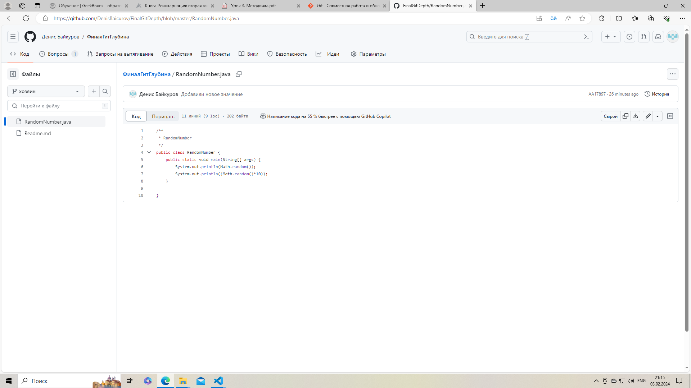

Пригласите в свой проект кого-то из коллег по обучению, дайте им доступ к своему репозиторию (кроме ветки master).
Защита ветки master

Добавляем в проект коллег

Ставим задачу получить дополнительно случайное число от 1 до 10 

пользователь 19denca80 вносит изменения в ветку master1 

принимаем pull request , производим слияние и принимаем изменения, внесённые 19denca80

